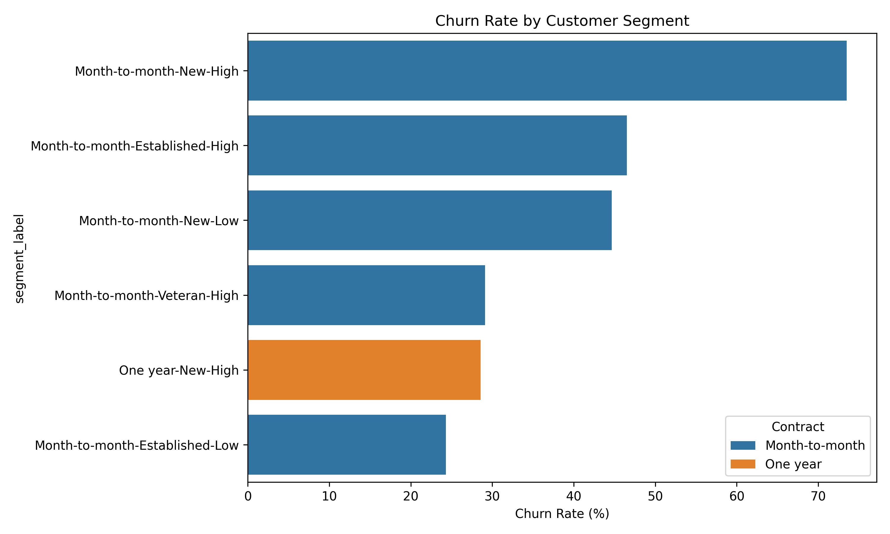

#  Telecom Customer Churn & Revenue Risk Analysis

##  Business Overview
The goal of this project is to identify high-risk customer segments and quantify the financial impact of churn. Instead of looking at general churn, this analysis performs a **Deep-Dive Segmentation** to uncover which customers are leaving and why.

##  Key Business Discovery
Through SQL segmentation and Python EDA, I discovered a **High-Risk "Danger Zone"**:
* **Segment:** New Customers (<12 months) + Month-to-Month Contracts + High Monthly Charges (>$80).
* **Churn Rate:** **73.5%** (compared to the company average of 26%).
* **Revenue at Risk:** **$406,000 annually** from this single segment.

##  Technical Workflow
1. **Data Extraction & SQL:** Used **CTEs** and **Case Statements** to create feature engineering segments (`tenure_segment`, `spend_tier`).
2. **EDA (Python):** Utilized **Seaborn** and **Matplotlib** to visualize correlations between contract types and churn.
3. **Financial Modeling:** Calculated the **Annual Revenue at Risk** by aggregating monthly charges of at-risk segments.

##  Visual Analysis
> *Note: Add your churn_analysis.png here to show your charts!*

##  Strategic Recommendations
* **Proactive Onboarding:** Implement a 90-day intensive onboarding program for the high-value/flexible-contract segment.
* **Incentivized Migration:** Offer a 10% discount for customers who switch from Month-to-Month to 1-Year contracts.
* **Potential Impact:** Targeted churn reduction from 73.5% to 50%, retaining **$131,000 in annual revenue**.

##  Project Structure
* `main.sql`: Advanced SQL queries for segmentation.
* `main.ipynb`: Python notebook for EDA and visualization.
* `analysis_report.pdf`: Full executive summary of findings.
